# Dit is een schoolproject!!

## BrowserTechnologies

## De opdracht

Op basis van een officiële PDF van de Nederlandse belastingdienst ga je een interactief web-formulier maken. Met behulp van de power of HTML and CSS ga je een degelijk ontworpen web-formulier bouwen met een duidelijke focus op usability en accessibility. Je gebruikt de kracht van JavaScript waar nodig om dit formulier nóg bruikbaarder, beter en wellicht zelfs leuker te maken.

Je bouwt dit formulier volgens de principes van progressive enhancement. Je gaat je formulier testen op allerlei verschillende hard- en sortware, zowel oud als niet, met allerlei verschillende manieren van input en output. Je zorgt er voor dat het overal werkt, en je zorgt er voor dat het zo mogelijk zelfs heel erg goed werkt.

## Eerdere versie input fields
Bij mijn eerste versie heb ik een volgende button gemaakt die de velden checked. Achteraf bleek dat dit best wel veel werk is dus dit heb ik later weggehaald. Het was ook niet ideaal dat de gebruiker zijn/haar input niet direct wordt gevalideerd.

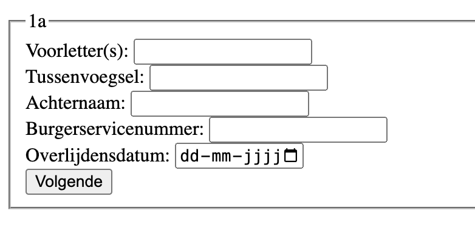
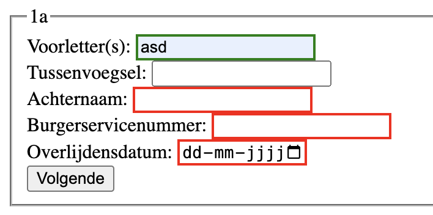

## Eerdere versie radiobuttons
Ik heb dezelfde techniek gebruikt voor de radiobuttons. Hier heb ik ook een check gemaakt door gebruik te maken van een button. Dit heb ik later dynamisch gemaakt omdat het anders te veel kliks worden.

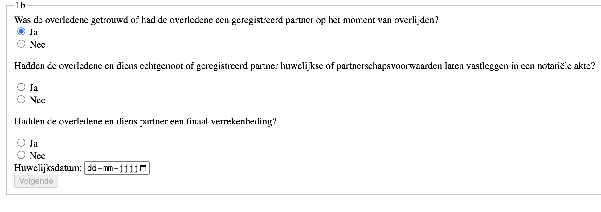
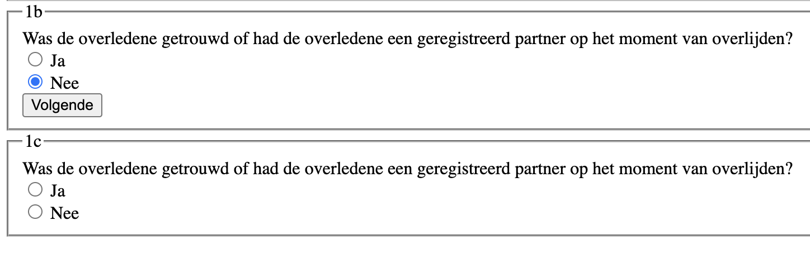


# Uitleg eindwerk

De inputfields hebben allemaal eenvalidatie. Nadat de gebruiker een veld invuld wordt dit groen of rood. Als het rood wordt komt er ook nog een error melding in beeld. Ik heb het input overal in een label gezet.

```html
<label for="1aVoorletters">*Voorletter(s):
    <input
        type="text"
        id="1aVoorletters"
        name="voorletters"
        pattern="[A-Za-z\.]*"
        placeholder=""
        required/>
    <span data-error>&#9888; Voer uw voorletter(s) in<span>
</label
```

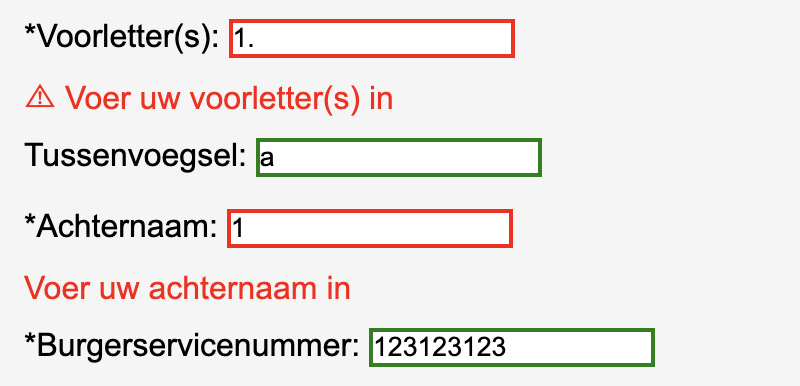

## Voorletters en achternaam

Hoofdletters bij de 'voorletters' en de 'achternaam' begint altijd met een hoofdletter. Dit heb ik beide gedaan door een script hiervoor te maken.

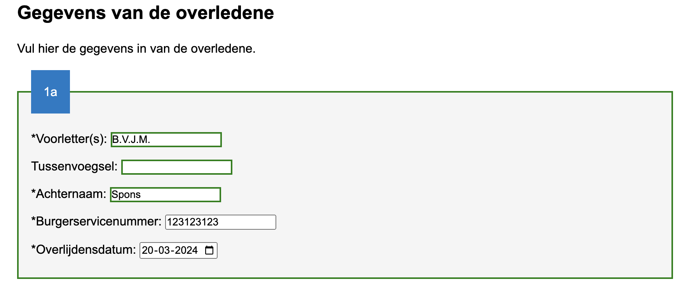

## Datum

De datum heb ik gemaakt door input type date te gebruiken. Via Javascript heb ik toegevoegd dat de datum maximaal tot vandaag kan.

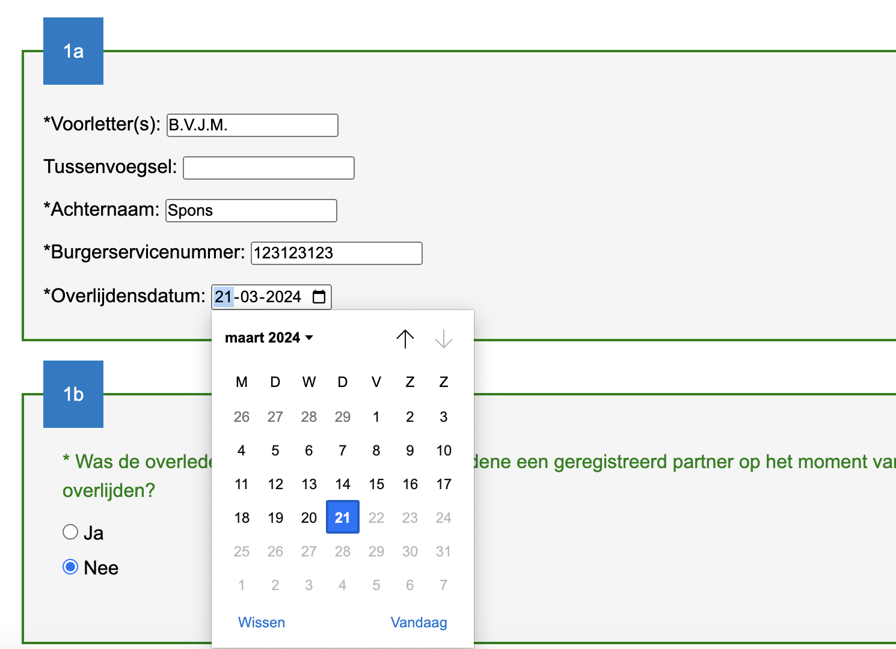

## Localstorage

Ik heb localstorage gebruikt. Dit werkt goed. Alle radiobuttons worden goed onthouden en degene waar 'ja' is ingevuld worden de optionele vragen ook ingevuld

```javascript
function initLocalStorage() {
  const formulieren = document.querySelectorAll(".formulier");
  formulieren.forEach(function (formulier) {
    const inputFields = formulier.querySelectorAll("input");
    inputFields.forEach(function (inputField) {
      inputField.addEventListener("change", function () {
        if (inputField.type === "radio" && inputField.checked) {
          // For radio buttons, use the 'name' as key to store the value for the group
          const key = "dataSaved" + inputField.name;
          localStorage.setItem(key, inputField.value);
        } else if (inputField.type !== "radio") {
          // For other input types, save as before
          const key = "dataSaved" + inputField.id;
          localStorage.setItem(key, inputField.value);
        }
      });
    });

    window.addEventListener("load", function () {
      inputFields.forEach(function (inputField) {
        let key =
          inputField.type === "radio"
            ? "dataSaved" + inputField.name
            : "dataSaved" + inputField.id;
        const dataSaved = localStorage.getItem(key);
        if (dataSaved !== null) {
          if (inputField.type === "radio") {
            inputField.checked = inputField.value === dataSaved;
            // Adjust visibility on load
            if (inputField.checked) {
              showNext({ target: inputField });
            }
          } else {
            inputField.value = dataSaved;
          }
        }
      });
    });
  });
}
```

## Responsive design en voortgaang zichtbaar

Velden (div class="formulier") valideren + navigatie groen kleuren

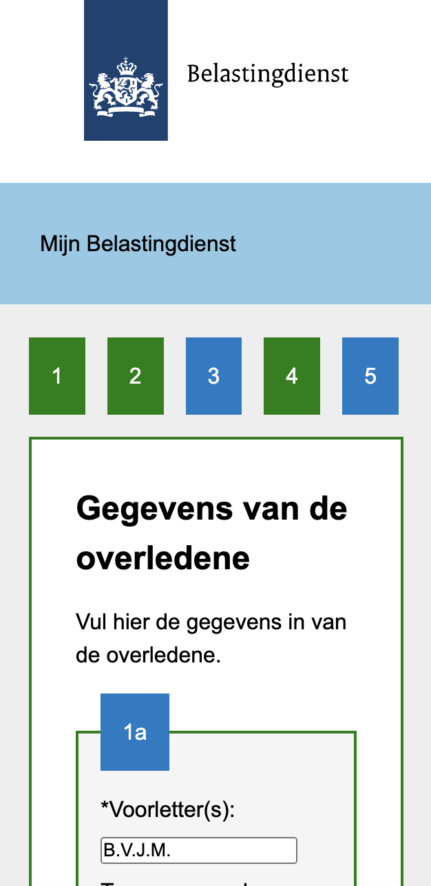

## Shownext

De belangrijkste functie van mijn project is de 'shownext' functie. Ik heb een aantal functies gemaakt en deze aangeroepen in deze functie. Ik heb een aantal vragen 'optioneel' gemaakt.

Als de gebruiker op 'Ja' klikt:

- Optionele vragen worden getoond
- Optionele vragen worden nu 'required'

Als de gebruiker vervolgens op 'Nee' klikt:

- Optionele vragen worden niet meer getoond
- Optionele vragen zijn niet meer 'required'
- Als er optionele vragen zijn ingevuld worden deze weer leeg gemaakt

```javascript
function showNext(e) {
  const huidigeSectie = e.target.closest(".vraagContainer");
  const isNested = huidigeSectie.getAttribute("data-id");
  if (!isNested) return false;

  let volgendeSectie = huidigeSectie.nextElementSibling;
  let showedSomething = false;

  while (volgendeSectie && volgendeSectie.classList.contains("optioneel")) {
    if (e.target.defaultValue === "ja") {
      volgendeSectie.classList.remove("verborgen");
      volgendeSectie
        .querySelectorAll("input")
        .forEach((input) => (input.required = true));
      showedSomething = true;
    } else if (e.target.defaultValue === "nee") {
      volgendeSectie.classList.add("verborgen");
      volgendeSectie
        .querySelectorAll("input, select, textarea")
        .forEach(resetValue);
      volgendeSectie
        .querySelectorAll("input")
        .forEach((input) => (input.required = false));
    }
    volgendeSectie = volgendeSectie.nextElementSibling;
  }
  return showedSomething;
}
```

## Submit button

Als alles is ingevuld dan kan de gerbuiker op de 'submit' button klikken. Er wordt vervolgens genavigeerd naar een andere pagina waar alle vragen met antwoorden te zien zijn. Dit is een website gemaakt door Jeremy Keith.

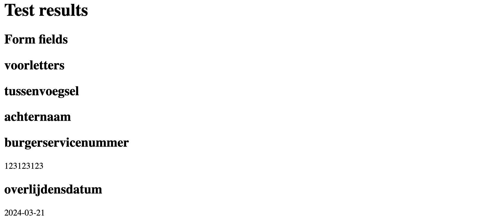

# Vraag 4 dynamisch

De gebruiker kan dynamisch een legaat toevoegen. Ook kan de gebruiker een extra verkrijger toevoegen. Dit gaat ook dynamisch. Dit heb ik gedaan via Javascript

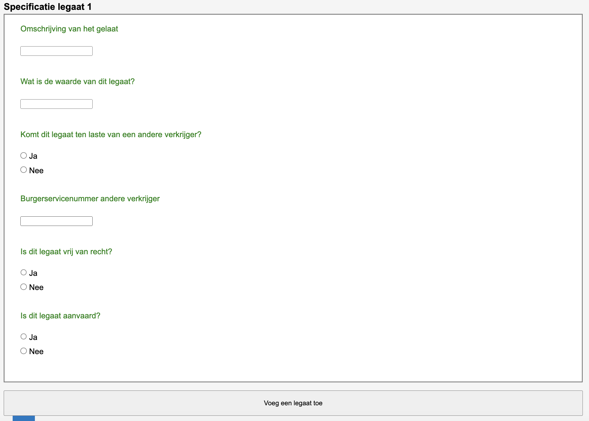

## Toelichting

Op de website zijn een aantal toelichtingen te vinden. Ik heb de huisstijl gebruikt van de belastingsdienst. De kleur blauw is daar vandaan gehaald.

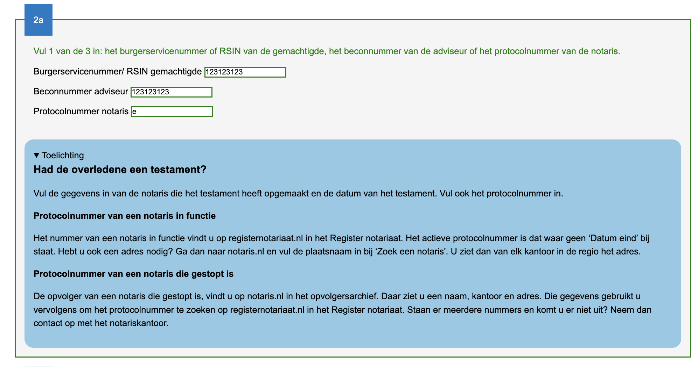

## Progressive enhancement

Het formulier werkt met met alleen HTML. Door de fieldsets is het nog best wel overzichtelijk.

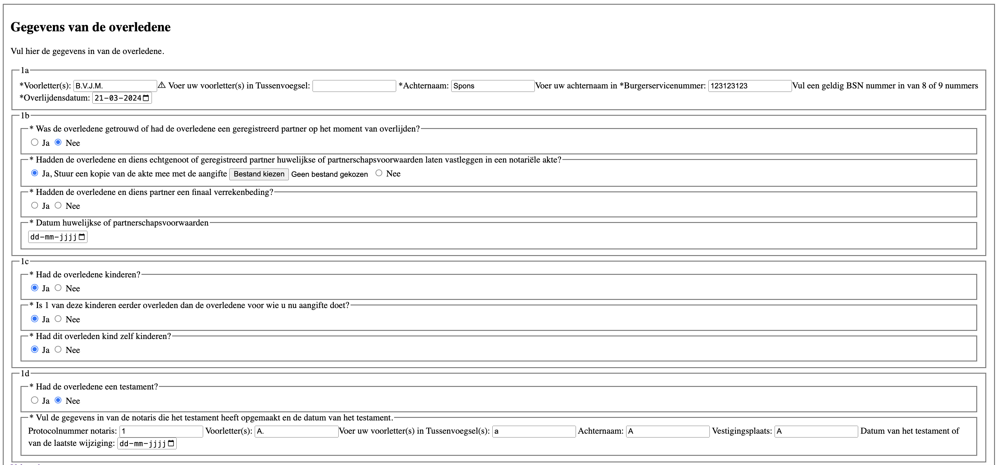
